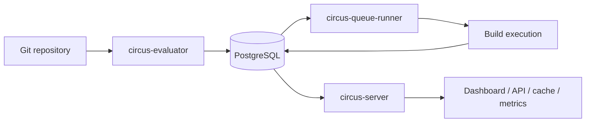
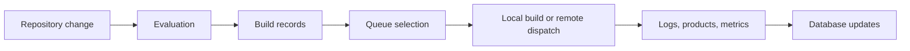
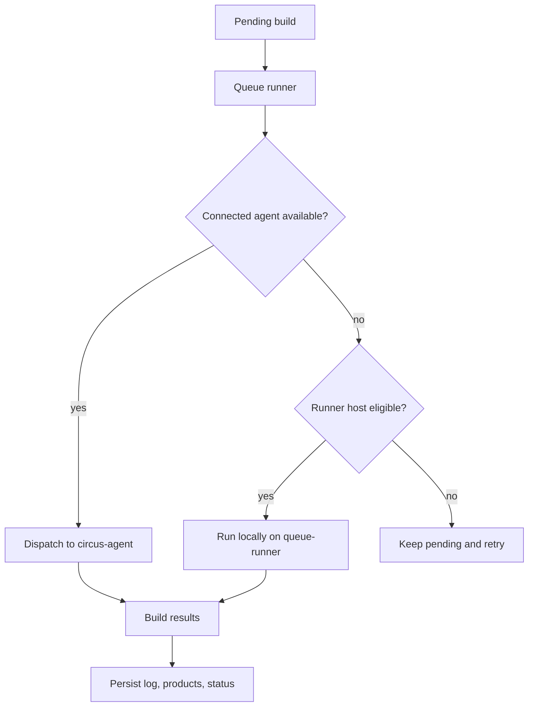
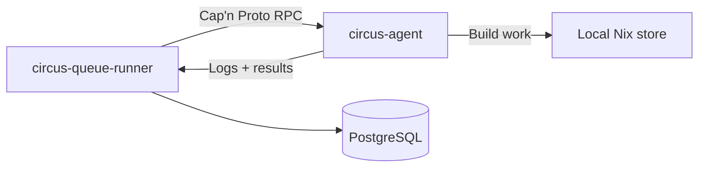

# Design

Circus is a Nix CI system built around a small set of long-running daemons and a
PostgreSQL database that acts as the source of truth. Circus currently deploys
as:

- **`circus-server`**, which serves the API, dashboard, binary cache, metrics,
  webhooks, and handles authentication
- **`circus-evaluator`**, which polls repositories and turns changes into
  evaluation records
- **`circus-queue-runner`**, which selects builds, dispatches work, and manages
  build execution
- **`circus-agent`**, which runs on build hosts, receiving work over a
  long-lived RPC connection as an optional distributed-build path

In addition to the Circus components, **PostgreSQL** is used to store all
durable state.

> [!TIP]
> Circus is currently pre-1.0, so this document may be outdated at any given
> time, and the design might change as time passes. For the time being the
> document aims to cover how the pieces connect, what each daemon does, and
> where each part fits. Suffice to say architecture _will_ evolve before 1.0 and
> this document will eventually trail behind, however, we will ultimately
> stabilize this design and thus make this document more reliable. Until then,
> treat it as best-effort, and please feel free to contact us through the issues
> tab if something here doesn't match what you see in the code. Cheers :)

Most user-facing behaviour flows through the central server. The build pipeline
is deliberately split into multiple steps and components with the goal of
distributing said features. Circus keeps this separation visible in the UI and
the database as well as the deployment options.

## Design Principles

Circus is organized around certain concepts borrowed from Hydra. Namely, those
six concepts:

- **Projects** group related repositories
- **Jobsets** describe what to evaluate and build
- **Evaluations** record a particular repository state
- **Builds** are execution results users inspect
- **Channels** provide promoted outputs for consumers
- **Users and API keys** control access

## The Main Pieces

### `circus-server`

The central server is the public face of Circus. It serves the dashboard,
exposes the REST API, handles log and build browsing, publishes Prometheus
metrics, and answers cache and webhook requests.

It also manages:

- API keys and user sessions
- dashboard login flows (local, OAuth, LDAP)
- project, jobset, channel, build, and evaluation pages
- binary cache endpoints at `/nix-cache/`
- authentication-backed admin operations

### `circus-evaluator`

The evaluator watches projects for changes and records new evaluations in the
database. It turns a repository update into something the rest of Circus can act
on. It:

- polls configured repositories
- reacts to database notifications when work changes
- evaluates Nix expressions
- records evaluation results and derived build data

Jobsets pick how the evaluator triggers:

- **`source_change`** is the default CI behaviour. Webhooks, manual triggers,
  and periodic git polling wake the evaluator, but unchanged source and input
  hashes are skipped.
- **`interval`** treats `check_interval` as a scheduled rebuild cadence. The
  evaluator creates a fresh evaluation and build set on each tick, even when the
  source revision is unchanged. The queue runner bypasses Circus-level build
  result caches and passes `--rebuild` to Nix. Source-change and manual trigger
  rows are not consumed for interval-mode jobsets. A new interval run is skipped
  while the previous run still has pending or running work.

### `circus-queue-runner`

The queue runner owns build execution. It pulls pending builds from the
database, chooses where they should run, and drives the build lifecycle.

Two dispatch paths:

- **Persistent agents** &mdash; connected `circus-agent` processes receive work
  over Cap'n Proto RPC. This is the preferred path.
- **Local runner builds** &mdash; the queue-runner host builds locally when it
  advertises the required system and features.

### `circus-agent`

A long-running helper that sits on a build host. It connects back to the queue
runner, advertises the host's capabilities (system, features, CPU count, speed
factor), accepts assignments, streams logs, and reports results.

This is the distributed-build path. Instead of the runner shelling out to SSH
for every build, agents maintain a persistent connection so the runner pushes
work down the wire without per-build SSH setup.

### `circus-common`

Holds the shared pieces used by all daemons:

- database access helpers
- shared data models
- bootstrap and repository logic
- shared validation and maintenance helpers

Configuration structs and loading live in `circus-config`; common depends on
that crate rather than owning the schema. Domain enums shared by config, common,
and CLI code live in `circus-types`.

### `circus-proto`

The Cap'n Proto schema and generated Rust bindings for the runner-to-agent RPC
protocol. The schema defines the protocol interfaces: registration, build
assignment, log streaming, result reporting, and presigned upload negotiation.
The proto crate is versioned independently so the runner and agent can detect
protocol mismatches at connection time.

### `circusctl migrate` and `circus-migrations`

Database schema management. `circusctl migrate` is the CLI entry point;
`circus-migrations` contains the SQL migration files and runtime support.

### `xtask`

While this is not a part of actual Circus deployments, it still deserves a
honorable mention. `circus-xtask` is our developer tooling crate. It provides
commands you'd expect from a command runner, but with access to library APIs of
Circus crates. One example is the API documentation generator task and the
accompanying route drift checks for validating `API.md`. It can also invoke the
formatter, which is only provided as Rust crate, for Askama templates.

### Supporting crates

Several crates are intentionally small boundaries rather than daemons:

- `circus-config` - shared TOML/env configuration schema and validation
- `circus-logs` - tracing configuration and subscriber initialisation
- `circus-nix` - Nix store, derivation, flake, and validation helpers
- `circus-notification` - notification channel construction and delivery
- `circus-s3` - S3 signing and cache upload helpers
- `circus-types` - shared enums used across config, API, and CLI code

All Circus crates are published on <https://crates.io> in the case you're
interested in interacting with the library side of things.

## Data Flow

The build pipeline is split into stages so each step can be observed
independently.

The database is not a passive store. It is the handoff point between services.
The evaluator records what should happen, the queue runner decides what runs,
and the server reads the results back for users.

### What gets stored where

- **PostgreSQL** - projects, jobsets, evaluations, builds, users, API keys,
  notifications, and service state
- **Filesystem** - logs, cache material, build working data, and other runtime
  artifacts
- **Nix store** - actual build outputs

## Build Execution

The queue runner chooses the execution path for a build based on the configured
systems, available builders, current load, and whether persistent agents are
connected.

The persistent agent path is used when the queue runner has an active connection
to a suitable host. When no agent is available, the runner falls back to the
local queue-runner host when its configured systems and features allow it.

## Distributed Builds

Circus pushes build work to agents over Cap'n Proto RPC rather than requiring
per-build SSH sessions.

The agent connection is long-lived, so the queue runner has a live view of which
machines are available, what they can build, and how loaded they are. The runner
prefers a connected agent over a local build on the queue-runner host.

If the connection drops, the runner marks that agent as unavailable and retries
the build elsewhere on the next pass. Dropped connections do not need operator
cleanup; the system handles them without manual intervention.

## RPC Protocol

The runner and agent communicate over Cap'n Proto RPC. The protocol is defined
in `crates/proto/schema/circus.capnp`; the generated bindings live in
`circus-proto`.

Connection lifecycle:

1. The agent connects to the runner's RPC endpoint (`circus://` or
   `circus+tls://`)
2. The agent calls `Runner.register` with its machine info: name, systems,
   features, speed factor, CPU count
3. The runner validates the protocol version and stores the agent's capabilities
4. The runner calls `Builder.assign` on the agent when a matching build is
   available
5. The agent runs the build, streams logs via `LogSink`, and reports results via
   `ResultSink`
6. The agent sends periodic heartbeats with load averages, memory usage, and PSI
   (Pressure Stall Information) data

For presigned S3 uploads, the agent calls `Runner.requestPresignedUrls` before
starting the build, then uploads directly to S3 and calls
`Runner.notifyUploadComplete` when done.

The runner can ask an agent to shut down gracefully by calling
`Builder.shutdown`, or abort a build by calling `Builder.abort`.

## Notifications

Circus sends notifications through six channels on build events:

- **Generic webhook** - POST a JSON payload to a configured URL
- **GitHub commit status** - update the commit status via the GitHub API
- **Gitea/Forgejo commit status** - update via the Gitea or Forgejo API
- **GitLab commit status** - update via the GitLab API with a private token
- **Slack** - post a formatted message via a Slack incoming webhook
- **Email** - send an email via SMTP with optional TLS (using lettre)

Notifications fire on build creation (pending), build start (running), and build
completion (success or failure). All types support a retry queue with
exponential backoff, configurable max attempts, and a retention period for
completed tasks. Webhook ingestion handles inbound push events from GitHub,
Gitea, Forgejo, and GitLab. These trigger evaluations on the matching jobset
when the pushed branch matches.

## Authentication and Security

Circus supports four authentication methods:

- **API keys** - Bearer tokens stored as SHA-256 hashes. Used for API access and
  dashboard login. Keys carry a role (admin, read-only, or custom granular
  permissions).
- **User accounts** - username/password with session cookies. Used for dashboard
  access. Passwords are hashed with argon2.
- **OAuth (GitHub)** - optional OAuth2 flow with CSRF protection. Users
  auto-upsert with a read-only role on first login.
- **LDAP** - bind-based authentication with DN template substitution.
  Auto-upserts local users.

The server makes additional effort on enforcing security. There exist CSRF
protection with per-process secrets, various secutity headers, request body size
limits, CORS, audit logging and a bit more.

Evaluation runs independently in a sandbox. The evaluator runs Nix with
`restrict-eval`, so a jobset can only fetch URIs on an allowlist, and
`import-from-derivation` is off by default. The allowlist is derived from the
project's `flake.lock`, so locked inputs resolve while undeclared eval-time
fetches are blocked. Deployers extend it with `evaluator.allowed_uris` or opt
out with `restrict_eval = false`.

## Binary Cache and Channels

Circus serves a Nix-compatible binary cache at `/nix-cache/`. It supports the
full narinfo protocol: clients request `.narinfo` files by hash, and the server
returns a relative NAR URL under `/nix-cache/nar/`.

> [!TIP]
> The server can optionally sign narinfo files with a Nix secret key. External
> cache uploads configure agent-side NAR compression under `[cache_upload]`.

Build outputs can be uploaded to an external cache store (typically S3) after a
successful build. The agent supports direct presigned S3 upload; the
queue-runner falls back to `nix copy` for SSH builders. Agent-uploaded narinfo
is persisted in the database. When clients request one of those NARs, the server
redirects to a short-lived signed S3 GET URL using the same bucket and prefix
rules as upload.

Channels provide promoted evaluation outputs for consumers. Each channel tracks
a git revision, a binary cache URL, and a store path listing. The server exposes
Hydra-compatible channel endpoints: `git-revision`, `binary-cache-url`,
`store-paths.xz`, and `nixexprs.tar.xz`.

## Configuration

Circus reads a TOML file. Environment variables override any field. All daemons
share the same configuration tree, but each only reads the sections it needs. On
server startup, declarative startup data bootstraps projects, jobsets, users,
API keys, and users from config.
