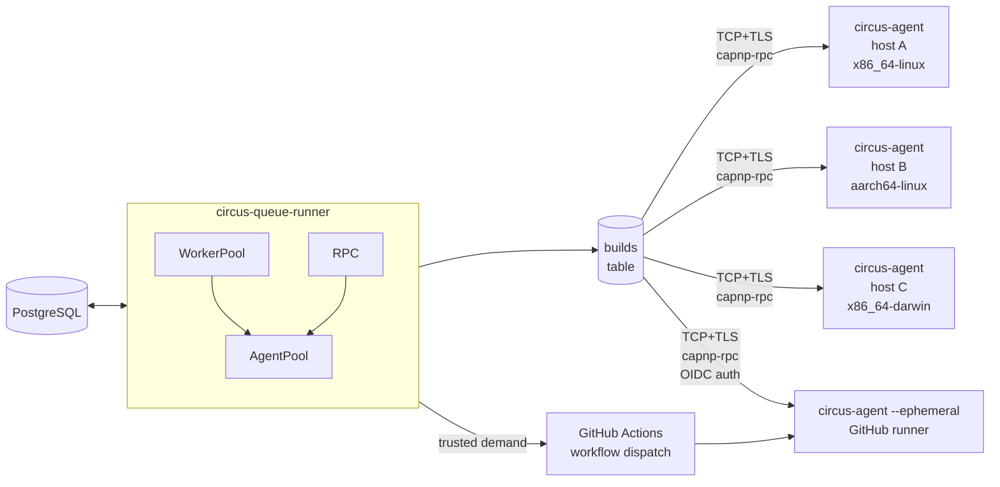

# Distributed Builds in Circus

[manic.systems]: https://github.com/manic.systems

Circus can run builds across a cluster of machines as per our needs in
[manic.systems]. The data plane is a fleet of **agents**, each running on a
build host. Agents connect outbound to the queue-runner over a TCP socket; the
runner pushes work down the connection, and the agent streams logs, results, and
outputs back up. Agents may be long-running hosts or single-session CI machines
such as GitHub Actions runners. This document covers the protocol, lifecycle,
failure model, trust boundaries, and how the agent path coexists with legacy SSH
dispatch.

## Why not Hydra's (gRPC) Design?

The new Rust rewrite of Hydra implements this layer with gRPC + tonic +
protobuf. That choice is reasonable, and the schema is the obvious starting
point for any modern fork. Circus picks a different transport: **Cap'n Proto**
with `capnp-rpc`. The reasons are concrete, not aesthetic:

1. **Object-capability RPC.** When an agent connects, it hands the runner a
   `Builder` capability. The runner holds that capability as a typed,
   per-connection handle. There is no `machine_id` lookup in a hash map on every
   method call: the capability _is_ the agent. Capabilities expire when the
   connection drops, so stale agent IDs cannot be addressed.
2. **Promise pipelining.** `assign(...)` returns a promise. The runner can
   immediately use that promise to send `log.write(chunk)` or `result.report`
   without an extra round trip, because the parameters of the next call ride
   along with the first. With gRPC over HTTP/2 this is one ack per call.
3. **No HTTP/2 overhead.** Cap'n Proto runs over plain framed TCP (or a
   tokio-rustls TLS stream). For an internal cluster protocol, HTTP/2's
   stream-prioritisation and headers are not load-bearing, and they cost
   throughput.
4. **Smaller dependency graph.** `capnp`, `capnp-rpc`, `capnp-futures` together
   are leaner than `tonic` + `prost` + `tonic-prost` + `hyper` + `h2` + `tower`.
   Less to keep up to date, less to audit.

Admittedly this comes with a few tradeoff. Namely, the schema is custom and
there is no built-in reflection or "describe service" tooling. We do, however,
compensate with a stable schema, semver, and `protoVersion` strings exchanged at
register time. TLS is also not built-in, but we can easily layer `tokio-rustls`
underneath the framed transport. mTLS works the same way: rustls verifies both
sides before any Cap'n Proto bytes flow.

## Topology



One queue-runner, N agents. The queue-runner owns:

- the build queue (PostgreSQL `builds` table)
- the in-memory `AgentPool` (live capabilities, one per connected agent)
- scheduling: choosing which agent gets which build

Each agent owns:

- the local Nix store on its host
- one Nix build process per concurrent build
- log capture and result reporting

There is no agent-to-agent traffic. Nor do the agents talk to PostgreSQL
directly.

## Protocol

The schema is in `crates/proto/schema/circus.capnp`. The interfaces are:

```capnp
interface Runner {
  register @0 (info :AgentInfo, builder :Builder) -> (session :AgentSession);
  version @1 () -> (proto :Text, server :Text);
  requestPresignedUrls @2 (machineId :Text, buildId :Text,
                            request :List(PresignedNarRequest))
                       -> (responses :List(PresignedNarResponse));
  notifyUploadComplete @3 (machineId :Text, buildId :Text, narInfo :NarInfo)
                       -> ();
}

interface Builder {
  assign @0 (job :BuildAssignment, log :LogSink, result :ResultSink,
             output :OutputSink) -> ();
  abort @1 (buildId :Text) -> ();
  shutdown @2 (reason :Text) -> ();
}

interface AgentSession {
  heartbeat @0 (ping :Heartbeat) -> ();
}

interface LogSink {
  write @0 (chunk :Data) -> ();
  close @1 () -> ();
}

interface OutputSink {
  write @0 (chunk :Data) -> ();
  close @1 () -> ();
}

interface ResultSink {
  report @0 (result :BuildResult) -> ();
}

struct AgentInfo {
  hostname           @0  :Text;
  name               @1  :Text;
  machineId          @2  :Text;
  systems            @3  :List(Text);
  supportedFeatures  @4  :List(Text);
  mandatoryFeatures  @5  :List(Text);
  speedFactor        @6  :Float32;
  cpuCount           @7  :UInt32;
  maxJobs            @8  :UInt32;
  protoVersion       @9  :Text;
  authToken          @10 :Text;
  ephemeral          @11 :Bool;
}
```

The flow is as follows

1. Agent dials TCP (optionally wraps in TLS), starts a capnp-rpc system with no
   bootstrap. Calls `runner.register(info, builder)` and keeps the returned
   `session` capability for heartbeats.
2. Runner authenticates registration. It first tries bearer-token auth against
   `[queue_runner.rpc].auth_tokens`; if that fails and `[queue_runner.rpc.oidc]`
   is configured, it verifies the presented JWT against the issuer JWKS,
   accepted audiences, and repository allowlist.
3. Runner records the agent in `AgentPool`, retains the `Builder` capability,
   marks the row in `builder_sessions` as live, and stores whether the session
   is ephemeral and whether it authenticated through `token` or `oidc`.
4. WorkerPool dequeues a build. The scheduler picks an agent based on `systems`,
   `mandatoryFeatures`, current load, speed factor and PSI thresholds. It calls
   `builder.assign(job, log, result, output)`. Promise pipelining means the
   runner can immediately enqueue follow-up calls against these capabilities if
   needed; in practice it just awaits them.
5. Agent writes log lines via `log.write(chunk)` and ends with `log.close()`. On
   completion it calls `result.report(BuildResult)`. Both sinks are server-side
   capabilities the runner created and passed down; on the runner side `write`
   appends to the live log file and independently enforces the per-build log
   cap, while `report` accepts exactly one final result before waking the
   scheduler.
6. For non-presigned uploads, the agent streams the output closure through
   `OutputSink`. For S3 presigned uploads, `output` is null and the agent
   uploads compressed NAR files directly to S3.
7. The agent calls `session.heartbeat(ping)` every N seconds with load averages,
   memory, store/build-dir free, current job count, and PSI (`cpuAvg10`,
   `memAvg10`, `ioAvg10`). The runner uses these to gate subsequent dispatch
   decisions.
8. When the connection drops, capnp-rpc drops the `Builder` capability. The pool
   removes the connection only if it is still the live generation for that
   `machineId`, so a stale disconnect cannot evict a replacement connection.
   `AgentPool` notices closed dispatch channels on the next dispatch attempt and
   falls back to the next candidate. Any builds the disconnected agent had in
   flight are marked stuck and reset to `pending` by the orphan sweeper (already
   implemented at `crates/queue-runner/src/runner_loop.rs`).
9. If the runner's cache upload target is S3 and explicit presigning credentials
   are configured, `BuildAssignment.presignedUpload` asks the agent to upload
   outputs directly. The agent requests PUT URLs for the active
   `(machineId, buildId)` pair, streams each compressed NAR to S3, then calls
   `notifyUploadComplete`. The runner verifies the upload was presigned for that
   live build/path, fetches the uploaded object back from S3, verifies the
   compressed file hash/size, decompresses it, recomputes the canonical NAR
   hash/size, and only then signs and persists narinfo. Expected-upload state is
   cleared when the build completes or disconnects.

## Scheduling

The scheduler runs inside the queue-runner's worker pool. For a pending build
with a target `system`:

1. Query candidate agents from `AgentPool::candidates_for(system)`:
   `system in agent.systems` and `current_jobs < max_jobs`. Build-side required
   features must be a subset of the agent's `supported_features`, and an agent's
   `mandatory_features` must all be present on the build.
2. Apply PSI gating. If `psi_threshold` is set, drop candidates whose most
   recent heartbeat has any of `cpuAvg10 / memAvg10 / ioAvg10` above the
   threshold. Heartbeats older than `heartbeat_ttl_secs` are treated as
   "unknown" (advisory only, never penalise).
3. Drop ephemeral or OIDC-authenticated candidates unless the build came from a
   trusted project ref. A trusted ref is a concrete jobset branch from a
   non-PR/non-MR evaluation. For OIDC sessions, the token repository must also
   match the project repository.
4. Apply the configured strategy. `SpeedFactorOnly` orders by
   `speedFactor DESC`. `CpuCoreCountWithSpeedFactor` orders by
   `cpuCount * speedFactor DESC`. `Dynamic` orders by
   `(max_jobs - current_jobs) * speedFactor DESC`, so an idle agent wins over a
   partially-loaded faster one.
5. Try candidates in order, sending a `DispatchCommand` through the per-agent
   mpsc. On `Disconnected`, fall through to the next candidate.
6. If no agent matches, fall back to SSH dispatch (legacy path) when a
   `remote_builders` row matches by system, then to the queue-runner host when
   `local_systems`/`local_features` allow it. If no venue can run the build,
   leave it pending and try again on the next tick.

PSI is local to the queue-runner: the agent reports raw numbers in each
heartbeat, the runner caches the most recent snapshot per agent and the
scheduler reads from that cache. No SSH probing in the agent path.

## Coexistence with SSH dispatch

The existing `run_nix_build_remote` path (SSH + `nix build --store ssh://...`)
stays. The scheduler tries the agent pool first; only when no agent advertises
the required `system` does it look at the legacy `remote_builders` table. This
lets clusters mix:

- Hosts that run `circus-agent` and get push-based dispatch with real-time
  heartbeats and PSI gating.
- Hosts reachable only by SSH, treated as pull-by-the-runner like before.

A `remote_builder` row whose `name` matches a connected agent is upgraded: the
SSH path becomes a cold standby and the agent path is preferred.

When `[queue_runner].ssh_require_host_key = true`, the SSH path only uses remote
builders that have a recorded `public_host_key`. Without it, the runner skips
that row instead of relying on OpenSSH `accept-new`.

## Cluster setup

Single queue-runner, multiple agents:

```toml
# circus.toml on the queue-runner host
[queue_runner]
poll_interval = 5
work_dir      = "/var/lib/circus/queue-runner"
psi_threshold = 80.0 # 0..100, advisory; null disables
ssh_require_host_key = true

[queue_runner.rpc]
bind               = "0.0.0.0:8443"
# SHA-256 hex digests of accepted bearer tokens.
auth_tokens        = [ "abcdef0123...sha256-of-the-raw-token" ]
max_connections    = 256
heartbeat_ttl_secs = 60
cache_substituter  = "https://ci.example.org/nix-cache/"
cache_public_key   = "circus-cache:..."

[queue_runner.rpc.oidc]
issuer               = "https://token.actions.githubusercontent.com"
audiences            = [ "circus-agent" ]
allowed_repositories = [ "example/circus-builders" ]
allowed_subject_prefixes = [
  "repo:example/circus-builders:ref:refs/heads/main",
]
allowed_workflow_refs = [
  "example/circus-builders/.github/workflows/circus-builder.yml@refs/heads/main",
]

[[queue_runner.ephemeral_pools]]
name = "gha-x86_64-linux"
allowed_build_repositories = [ "example/project" ]
systems = [ "x86_64-linux" ]
supported_features = [ ]
mandatory_features = [ ]
max_jobs = 1
cores = 0
speed_factor = 1.0
max_inflight = 4

[queue_runner.ephemeral_pools.github_actions]
workflow_repository = "example/circus-builders"
workflow = "circus-builder.yml"
ref_name = "main"
token_file = "/run/credentials/circus-queue-runner/github-token"
runner_url = "circus+tls://runner.internal:8443"
oidc_audience = "circus-agent"
agent_binary_url = "https://ci.example.org/artifacts/circus-agent-x86_64-linux"

[cache_upload]
enabled                    = true
store_uri                  = "s3://circus-cache/root"
compression                = "zstd" # zstd, xz, gzip, none
fail_build_on_upload_error = false  # true => agent uploadFailure fails build

[cache_upload.s3]
region            = "us-east-1"
prefix            = "nix-cache" # objects are written below root/nix-cache/
access_key_id     = "..."
secret_access_key = "..."

# optional, this can be omitted for plain TCP
[queue_runner.rpc.tls]
cert_file           = "/var/lib/circus/tls/runner.crt"
key_file            = "/var/lib/circus/tls/runner.key"
client_ca           = "/var/lib/circus/tls/clients.ca.crt" # enables client-cert verification
pin_cn              = true                                 # CN must equal agent.name
require_client_cert = false                                # true opts into strict mTLS
```

> [!NOTE]
> Agent uploads store NARs in S3 and persist the corresponding narinfo in the
> database. Cache consumers still use the Circus `/nix-cache/` URL; NAR
> downloads are redirected to short-lived signed S3 GET URLs by the server.

```toml
# circus-agent.toml on each builder host
[agent]
name                    = "build-01"
runner_url              = "circus+tls://runner.internal:8443"
auth_token              = "the-raw-token-the-runner-hashed"
systems                 = [ "x86_64-linux", "i686-linux" ]
supported_features      = [ "kvm", "nixos-test" ]
mandatory_features      = []
max_jobs                = 8
speed_factor            = 4.0
heartbeat_interval_secs = 10
reconnect_delay_secs    = 5
work_dir                = "/var/lib/circus-agent"
cores                   = 8

# required for circus+tls://
[agent.tls]
ca_file   = "/etc/circus/tls/runner.ca.crt" # required: trusts the runner cert
cert_file = "/etc/circus/tls/build-01.crt"  # optional: client identity (mTLS)
key_file  = "/etc/circus/tls/build-01.key"  # omit cert_file + key_file for token-only
```

For CI builders, set `agent.ephemeral` or pass `--ephemeral`. Ephemeral agents
generate a fresh, unpersisted machine ID, optionally append a unique suffix to
their name, run one connection session, drain in-flight work, and exit instead
of reconnecting:

```toml
[agent.ephemeral]
max_builds        = 1
max_lifetime_secs = 3600
max_idle_secs     = 120
unique_name       = true
```

The agent runs as a Systemd service. A NixOS module is provided at
`nix/modules/circus-agent.nix` and exposed as `self.nixosModules.circus-agent`.
The queue-runner picks the agent up the first time it connects; no operator
action is required beyond provisioning the token and (optionally) TLS material.

If you have a setup already, existing clusters keep working. To migrate a host:

1. Install `circus-agent` on the build host.
2. Issue an auth token, configure `circus-agent.toml`, start the service.
3. Confirm the host appears connected on the admin API:
   `GET /api/v1/admin/builders/sessions/connected` (live) or
   `GET /api/v1/admin/builders/sessions/{machine_id}` (single row).
4. Leave the `remote_builders` row in place. Once the agent is healthy you can
   drop the row, or keep it as a cold standby for the SSH path.

There is no flag day. The runner prefers connected agents over SSH on a
per-dispatch basis; flipping a host between the two transports is purely a
matter of which service is running.

`--ephemeral` enables the table with defaults when the config file does not
contain `[agent.ephemeral]`. When `unique_name = true`, the agent appends a
suffix based on `GITHUB_RUN_ID`, `GITHUB_RUN_ATTEMPT`, and a short slice of the
fresh machine ID; outside GitHub Actions it appends only the machine-ID slice.
The final name is truncated to the protocol limit, so concurrent CI jobs can use
the same configured base name without colliding in `builder_sessions`. The
lifecycle limits are deliberately drain-oriented:

- `max_builds` is checked after the agent is idle, so a build already assigned
  is allowed to finish before the agent exits.
- `max_lifetime_secs` starts draining when the wall-clock limit is reached; the
  agent waits up to the drain grace for running builds before disconnecting.
- `max_idle_secs` starts at connection time and is refreshed on assignment and
  completion, so an unused CI runner exits without waiting forever.

Disconnected ephemeral rows are marked `connected = false` like persistent
agents, then pruned by the queue-runner after the ephemeral session TTL.
In-flight builds that are lost with the CI VM are recovered by the normal orphan
reset and returned to `pending`.

## GitHub Actions Ephemeral Pool

`[[queue_runner.ephemeral_pools]]` lets the queue-runner scale one or more
short-lived GitHub Actions agent classes when trusted builds are waiting for
capacity. The runner does not hand GitHub arbitrary work. It dispatches a pool's
workflow only when a pending build is eligible for external execution, the
build's trusted project repository appears in `allowed_build_repositories`, the
configured systems/features match, and there is room under `max_inflight`.

Demand is counted per pool. A build contributes only when its system is in
`systems`, its required features are satisfied by `supported_features` and
`mandatory_features`, and its trusted project repository is in the pool
allowlist. Existing live capacity is counted only from connected agents that are
ephemeral, OIDC-authenticated from `github_actions.workflow_repository`, named
with the pool's `name` prefix, advertising one of the configured systems, and
able to satisfy the pending build's features. In-flight launches are counted as
provisional capacity until `inflight_ttl_secs` expires.

The workflow repository is intentionally separate from the source repositories
the pool may build. This supports a central builder repository that hosts the
workflow while Circus builds many project repositories.

Circus ships `.github/workflows/circus-builder.yml`, which:

1. receives workflow-dispatch inputs from the queue-runner,
2. installs Nix on the GitHub runner,
3. downloads the pinned `agent_binary_url`,
4. requests a GitHub OIDC ID token for `oidc_audience`,
5. runs `circus-agent --ephemeral` with direct CLI flags.

The workflow input contract is plain strings, not TOML fragments. Lists are
comma-separated values for `systems`, `supported_features`, and
`mandatory_features`. A replacement workflow should pass those values to
`circus-agent` as `--system`, `--supported-feature`, and `--mandatory-feature`
arguments.

The GitHub token configured through `token` or `token_file` must be allowed to
create workflow dispatch events in `github_actions.workflow_repository`. The
workflow itself needs `id-token: write`, because the agent authenticates to the
runner with the OIDC JWT in the existing `auth_token` field.
`queue_runner.rpc.oidc.audiences` must include `github_actions.oidc_audience`,
and `queue_runner.rpc.oidc.allowed_repositories` must include
`github_actions.workflow_repository`.

The autoscaler tracks launches in memory with `inflight_ttl_secs` and
`scale_up_cooldown_secs` so a slow-to-register runner does not cause an
unbounded workflow-dispatch loop. This is capacity control only; scheduling
trust is still enforced by the normal agent scheduler before each build is
assigned.

Operational notes:

- `token` or `token_file` must contain a GitHub token with permission to call
  the workflow-dispatch API for `github_actions.workflow_repository`.
- `runner_url` must be reachable from the GitHub-hosted or self-hosted runner;
  use `circus+tls://...` for internet-facing endpoints.
- `rpc.cache_substituter` and `rpc.cache_public_key` are required for ephemeral
  pools so a fresh GitHub runner can substitute the assigned derivation closure.
- `rpc.oidc.audiences` must include `github_actions.oidc_audience`, and
  `rpc.oidc.allowed_repositories` must include
  `github_actions.workflow_repository`; an empty OIDC repository allowlist
  rejects all OIDC agents.
- Restrict OIDC `sub` prefixes or `workflow_ref` values so only the intended
  workflow/ref can register agents for the pool.
- OIDC-authenticated agents are only assigned trusted-ref builds: concrete
  jobset branches from source-change, manual, or interval evaluations, not PR/MR
  evaluations. For OIDC agents, the project repository must parse as a GitHub
  `owner/repo` slug and match the token repository.

## Security

- Bearer token authentication on `register`. Tokens are issued by the operator
  out of band. The runner stores SHA-256 hex digests in
  `[queue_runner.rpc].auth_tokens`; the agent sends the raw token and the runner
  hashes + compares digest bytes in constant time. Config validation rejects
  malformed token digests.
- OIDC authentication on `register` when `[queue_runner.rpc.oidc]` is set. The
  runner verifies the issuer, JWKS signature, expiry, accepted audience,
  subject, workflow/ref constraints, and repository allowlist before accepting
  the session. The verified repository is stored with the live session for
  scheduling decisions.
- Optional mTLS via `tokio-rustls`. Cert + key live under
  `[queue_runner.rpc].tls`, and setting `client_ca` attaches a
  `WebPkiClientVerifier` for any client cert an agent presents. Agents may still
  connect token-only unless `require_client_cert = true` is set. With
  `pin_cn = true`, the verified cert name must match the registered agent
  `name`.
- Cap'n Proto framing is bounded by `capnp::message::ReaderOptions` defaults;
  oversized messages are rejected at decode. Circus also enforces
  application-level limits from `circus_proto::limits`: bounded registration
  lists, bounded text fields, a maximum presign batch size, and a 1 MiB maximum
  log chunk.
- The runner caps per-build log size at `BuildAssignment.max_log_size` (passed
  down from the worker pool) on both sides. The agent aborts the child with
  `BuildOutcome::BuildFailure` plus an explanatory `error_message` when the cap
  is hit; the runner-side `LogSink` rejects over-cap writes even if an agent is
  faulty or malicious.
- `ResultSink.report` is one-shot. A duplicate final result is rejected and does
  not update agent success/failure counters a second time.
- Presigned uploads are tied to the registered connection, active build ID,
  store path, NAR hash, NAR size, compression and S3 object path.
  `notifyUploadComplete` fails if any of those values differ from the presigned
  request. Before signing narinfo, the runner fetches the uploaded object,
  verifies file hash/size, recomputes the uncompressed NAR hash/size, and
  rejects mismatches without persisting anything. Pending upload expectations
  are discarded when the dispatch finishes.
- OIDC-authenticated agents only receive trusted-ref builds. PR/MR evaluations
  and jobsets without a concrete branch stay on persistent agents, local builds,
  or the SSH path. Ephemeral lifecycle alone does not make an internal
  token-authenticated agent external.
